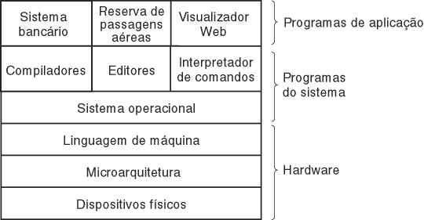
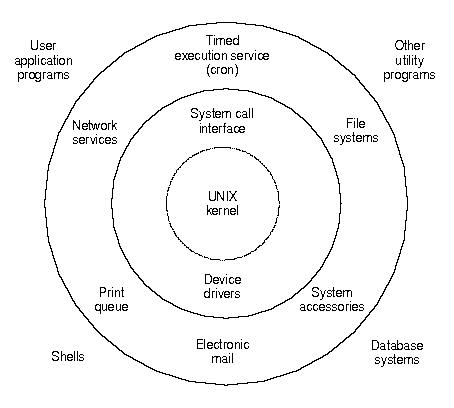
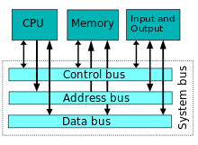
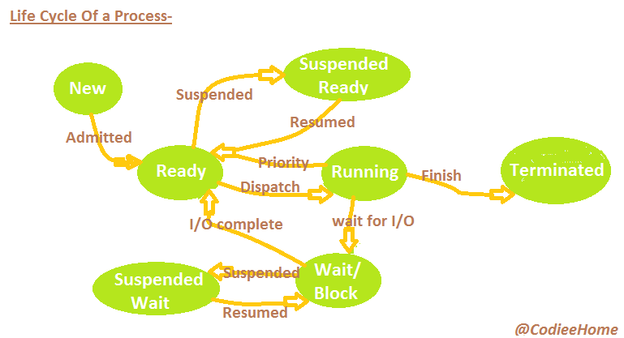

# Review Operational Systems

- [Introduction](#introduction)
- [Functionalities](#functionalities)
- [System Structure](#system-structure)
- [Process](#process)
- [Threads](#threads)
- [Inter-Process Communication](#inter-process-communication)
- [Schedulers](#schedulers)

## Introduction

An OS is a complex software. It has low level aspects (like drivers and management of memory devices) and high level aspects (like text editors and user interface)

The basics objectives of an OS can be described in two concepts: **Abstraction** and **Resources Management**.

### Abstraction

The OS must define abstract interfaces to access hardware resources. The abstraction makes apps independent of hardware. An app built for windows can run in every windows machine, doesn't matter to the app if it is a DualCore or a CoreI7. Define an API also makes development better, this way every program can access the same resource using the same technique.

### Resources Management

The OS must define rules to manage hardware resources usage and resolve race conditions or conflicts. One example of this need is the CPU. When a system is running, all kind of process request attention of CPU. If the OS doesn't manage that in a efficient way, probably we would have problems like starvation or slow processing time.

So wrapping it up, an OS abstracts the hardware, managing its resources and giving to apps an abstract environment of execution, where the access to the hardware happens using simple API's. Those API's should be consistent, don't matter in which hardware it is executing.

*Obs: A user level software can't access a hardware resource. It always have to request the action to OS*

### Components of an OS

## Functionalities

To achieve its goals of abstraction and resources management, an Operational System must cover a lot of areas. Each one of the system's resources have their own problems to be solved. Some of the implementations are:
- **Process Management**
- **Devices Management**
- **File System**
- **Memory Management**
- **Protection Management**
- Networking Support
- User interface
- Kernel
- etc

### Process Management

The objective of this functionality is fairly share the processing capacity between applications, avoiding starvation and always respecting the user's priority.

The process management tries to create an abstraction, in such way that it feels like "it has a processor to each program";

## Devices Management

Also known as I/O Management, it must implement an abstract form of  interaction between programs and devices (commonly called as drivers).

## File Systems

The File System is built over the Devices Management. Its main objective is create an abstraction of files and directories, defining their access interface and politics of use. Those files can be anywhere like a disk, cloud, USB device or a external disk.

## Protection Management (Security)

When computers are connected to network and shared by different users, it's important to strictly define the resources that each user can access (read, write and execute), and make sure that those rules are followed.

## Politics and Mechanisms

**Politics** are the abstract decision rules, that could be solved using high levels algorithms, like decide the amount of memory that each program might receive or what is the next network package to be sent.

**Mechanisms** are the low level procedures used to implement politics, like give or take memory from a program, send or receive a network package. The mechanisms must be sufficiently generic to change politics without change mechanisms.

# System Structure

An OS isn't a unique and closed block of code executing over some hardware. It's composed by many components with complementary goals. Some of that components are:

- **Core or Kernel:** it's the OS's heart. Its responsibilities is to manage hardware resources and implement the main abstractions used by programs.
- **Drivers:** Specific modules to access physical devices. There's a drive for each type of device.
- **Boot Code:** the hardware booting process requires complex jobs to be done, such as recognize the installed devices, test and setup them to be ready to use. Other important job is load the kernel in the memory and execute it.
- **Utilities Programs:** they are programs to make the user's life easier (files handling, commands interpreter, terminal, user interface, etc)

Most of the computers follows an architecture proposed by *John Von Neumann*. The main idea of this model is a program be loaded into the memory along the data.

## Physical Architecture

The essential components of a computer (CPU, Memory and I/O devices) are connected by buses to transfer data and commands.

### Buses
- Address bus says the memory position to be accessed
- Control bus says the action to be executed
- Data bus transports data between the CPU, Memory and I/O

### Central Processing Unity (CPU)

The core of a computer is the CPU. Its responsibility is read instructions and data from memory or devices, process them, and give back the results. A normal CPU consists of:
- Arithmetic and Logic Unity: logical operations and math stuff are done here
- Registers: store the working data
- Special Registers:
  - Program counter: stores the memory address of the next instruction to be loaded
  - Stack pointer: stores a pointer the running stack's top
  - Program Status Word: stores condition bits.

### Memory Management Unity (MMU)

It's the controller that mediates the access to the memory. It analyzes each address requested by the CPU, valid them, and make the needed address conversions to execute the requested command (read or write of some memory address).

## Interruptions and Exceptions

It's a important and common technique used in the interaction between CPU and controllers. When a controller has something important to give to the CPU, it has two communication alternatives:
- Wait until the CPU asks for the information (can be a slow process)
- Send a interruption (using the Control bus)

When a CPU receives an interruption, its circuits are headed to a default address, which has a routine to handle interruptions (interrupt handler). When this routine it's finished, the CPU comes back to the point when it stopped.

Each interruptions must be handled in a different way, so an OS defines an vector of addresses to each routine handler. This vector is known as *Interrupt Vector*

# Process

A **Program** is a finite sequence of instructions. Always stored in disk, it can't change itself.

A **Process** is an abstraction that represents a program being executed. Always stored in memory, it can change itself during the execution, and can have more than one program instance in execution.

## Process Control Block (PCB)

Represents the process inside of the OS. It's a memory segment reserved to the segment that keeps its information:
- PID (program identifier)
- State (running, blocked, etc)
- Address of next Instruction
- CPU Registers
- Memory Management infos
- etc

## Inter-Process Communication (ICP)

A process can't see other process, it is "isolated from exterior world". So it was built this mechanism (ICP) to share information between processes.

- Local mechanisms
  - Named pipes - First in First out (FIFO)
  - Unidirectional pipes
  - Message Queues
  - Shared Memory
- Client/Server mechanisms
  - Sockets
  - Remote Procedure Calls

## Processes Category

While a process is executing, it can perform only two behaviors:

- CPU Bound: math, memory/register operations
- I/O Bound: handling files and external devices (keyboard, mouse, sound, etc)

## Life Cycle

States of a process:
- Created: it was just loaded to the memory, it have never used the CPU
- Ready: Context fully loaded and ready to the CPU use
- Executing: in CPU
- Blocked: waiting for I/O event
- Suspended: swapping information from memory
- Finished

#Threads

In a multi-processed/cluster machine we can have a lot of process running at the same time, but there is cases that the need is a concurrence inside of the same process. This problem is resolved using **Threads**.

Threads are a mechanism to subdivide a process in two or more jobs that can be executed simultaneously. A thread shares the resources given to the parent process.

Obs: The PCB must have a list of threads!

# Inter-Process Communication

It's common to process exchange information between them. There are three topics related to that:
1. How a process sends information to other process
2. How to avoid communication conflicts
3. How handle dependencies. Example: A depends of B; B of C; and C of A. How to solve that?

## Direct Communication

A communication can be implemented by two basic actions: Send and Receive data. This approach, which the process who emits the data knows the receiver, is called Direct Communication.

Few systems implement this approach.

## Indirect Communication

This approach guarantee a communication without the receiver know the issuer and vice-versa. The OS creates an Communication Channel which gives the tools to process read and receive data.

In the real world, Indirect communication is implemented because its more flexible than direct.

## Synchronism

Talking about synchronism aspects, a Communication Channel can be:
- Synchronous: When the action of read or write blocks the Communication Channel
- Asynchronous: When the action of read or write doesn't block the Communication Channel
- Semi-Synchronous: When the action of read or write blocks the Communication Channel for a determined time

## Communication Mechanisms
- Shared memory
- OS built Mechanisms
  - Message exchanging
  - Pipes
  - Signals

# Schedulers

A scheduler, in a given list of process, is responsible for say which process is the next one to be executed. There are two types of scheduling:
- Short Time: Second Memory -> Main Memory
- Long Time: Main Memory -> CPU

The main objectives of a scheduler are:
- Maximize CPU usage
- Maximize number of done process per time unity
- Guarantee that all process receives the CPU
- Minimize response time to the user

The **Dispatcher** gives the control of a process to the CPU. Dispatch Latency is the time that a process dispatch takes to finish (a process is interrupted and the next one starts).

**Overhead** is the time of idle CPU

## Criteria to compare Schedulers:
1. CPU usage
2. Throughput (number of completed process per time unity)
3. Turnaround time
4. Waiting time
5. Response time

The objective is maximize criteria 1 and 2; Minimize criteria 3, 4 and 5.

## Type of Schedulers
- Non-Preemptive: process in execution can't be stopped
- Preemptive: process in execution can be removed from CPU

## Common Politics
- First In First Out (FIFO)
  - Preemptive
  - First process in the Queue is the first to executed
- Shortest Job First (SJF)
  - Preemptive
  - Shortest process is the first to be executed
  - Starvation
  - Problems in determine which process is shorter than other
- Round-Robin
  - Preemptive
  - Each process executes during a determine time slice
  - When the reserved time ends, the process goes to the end of the line
  - Similar to FIFO, but if a determine time to leave CPU
  - The time slice is called **Quantum**
- Priority
  - Non-Preemptive
  - Which process has an Priority, usually given by the CPU
    - An User can change a Priority
  - The Priority can be dynamic, the OS can change it to avoid starvation
- Multiple Queues
  - Preemptive
  - It has some Queues based on priorities.
    - Each Queue has a Politic to execute process. Can be FIFO, JSF, Round-Robin etc
